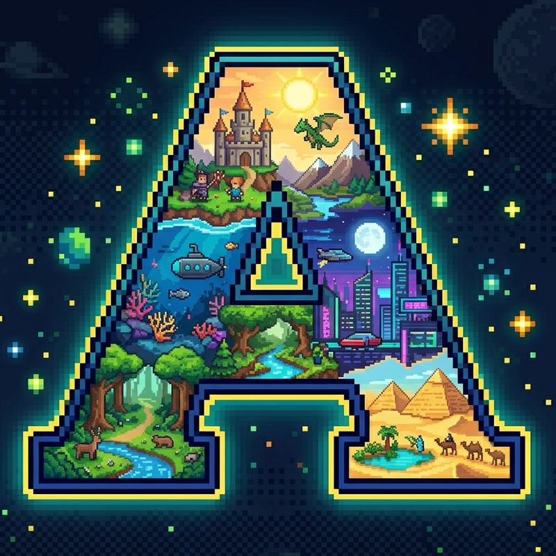

<p align="center">
  
</p>

<h1 align="center">amigo-engine</h1>

<p align="center">
  <a href="https://github.com/amigo-labs/amigo-engine/actions/workflows/ci.yml">
    
  </a>
  
  
</p>

<p align="center">
A pixel-art game engine with built-in editor, AI asset generation, and algorithmic chiptune music.
</p>

## Features

- Deterministic ECS with fixed-point math
- wgpu-based pixel-art renderer with particles, lighting, and post-processing
- Built-in level editor with Tidal Playground
- AI pipelines for art generation, music generation, and audio analysis
- TidalCycles mini-notation for algorithmic chiptune music
- 10 game-type templates (platformer, roguelike, shmup, RTS, puzzle, ...)

## Quick start

```sh
# Install the CLI (no Rust needed)
curl -fsSL https://raw.githubusercontent.com/amigo-labs/amigo-engine/main/install.sh | sh
```

**Windows (PowerShell):**
```powershell
irm https://raw.githubusercontent.com/amigo-labs/amigo-engine/main/install.ps1 | iex
```

Then create and run a game:

```sh
amigo new my_game
cd my_game
cargo run
```

> Building games requires the [Rust toolchain](https://rustup.rs/) and a Vulkan/Metal/DX12 capable GPU.

## Documentation

See the **[Wiki](https://github.com/amigo-labs/amigo-engine/wiki)** for full documentation:

- [Installation](https://github.com/amigo-labs/amigo-engine/wiki/Installation) -- detailed setup guide
- [CLI Reference](https://github.com/amigo-labs/amigo-engine/wiki/CLI-Reference) -- all commands
- [AI Setup](https://github.com/amigo-labs/amigo-engine/wiki/AI-Setup) -- `amigo setup` for AI pipelines
- [Audio Pipeline](https://github.com/amigo-labs/amigo-engine/wiki/Audio-Pipeline) -- audio-to-tidal conversion
- [Architecture](https://github.com/amigo-labs/amigo-engine/wiki/Architecture) -- crate overview
- [Specifications](https://github.com/amigo-labs/amigo-engine/wiki/Specifications) -- engine module specs

## License

Licensed under either of

- Apache License, Version 2.0 ([LICENSE-APACHE](LICENSE-APACHE) or <http://www.apache.org/licenses/LICENSE-2.0>)
- MIT License ([LICENSE-MIT](LICENSE-MIT) or <http://opensource.org/licenses/MIT>)

at your option.
