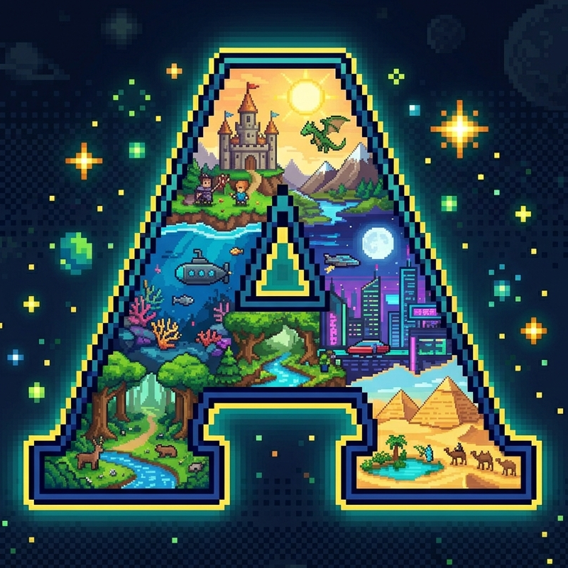

<p align="center">
  
</p>

<h1 align="center">amigo-engine</h1>

<p align="center">
  <a href="https://github.com/amigo-labs/amigo-engine/actions/workflows/ci.yml">
    
  </a>
  
  
  
</p>

<p align="center">
A pixel-art game engine in Rust with AI asset generation and algorithmic chiptune music.
</p>

## Features

- ECS with Q16.16 fixed-point simulation math (`Fix`, `SimVec2`) and a fixed 60 Hz timestep
- wgpu renderer for pixel art: sprites, particles, 2D lighting, post-processing, and an immediate-mode UI
- Scene stack, keyboard and mouse input, sound effects and music, sprite hot reload
- Headless mode with a JSON-RPC API, so Claude Code can drive a running game over MCP
- AI pipelines for art generation, music generation, and audio analysis (ComfyUI, Demucs)
- TidalCycles mini-notation for algorithmic chiptune music
- 18 game-type project templates, each scaffolded as a playable skeleton

## Status

Pre-1.0 and not production-ready. Small single-player games with keyboard, mouse
or gamepad work end to end. Several subsystems exist as library types that the engine
does not drive yet:

| Area | State |
|------|-------|
| Game loop, scenes, sprites, particles, lighting, post-processing, UI, pixel-perfect scaling | works |
| Keyboard, mouse and gamepad with action maps, SFX and music, sprite hot reload, headless API | works |
| Aseprite sprites with tag animations, tilemaps with view culling, save slots | works |
| Level editor (`amigo editor`) | Paints, fills, places entities, undoes and saves `.amigo` levels (F9); tiles preview as colours, no tileset rendering or path tool yet |
| Replays, lockstep netcode | library types only; physics and collision still use `f32` |
| AI tools (`amigo-artgen`, `amigo-audiogen`) | sprite, tileset, variation, inpaint and upscale generation, music, SFX, TTS and stem splitting run for real; the rest report "not implemented" |
| Targets | desktop only (Linux, macOS, Windows); no web or mobile |

The full list of open findings is in
[`docs/audit/2026-10-backlog.md`](docs/audit/2026-10-backlog.md).

## Quick start

```sh
# Install the CLI (no Rust needed)
curl -fsSL https://raw.githubusercontent.com/amigo-labs/amigo-engine/main/install.sh | sh
```

**Windows (PowerShell):**
```powershell
irm https://raw.githubusercontent.com/amigo-labs/amigo-engine/main/install.ps1 | iex
```

Or build it from source, which needs the [Rust toolchain](https://rustup.rs/)
(on Linux, install the [system libraries](https://github.com/amigo-labs/amigo-engine/wiki/Installation#system-dependencies-linux) first):

```sh
cargo install --git https://github.com/amigo-labs/amigo-engine amigo_cli
```

Then create and run a game:

```sh
amigo list-templates                   # platformer, roguelike, tower-defense, ...
amigo new my_game --template platformer
cd my_game
amigo dev                              # run, rebuild on code changes, hot-reload assets
```

> Building games requires the Rust toolchain and a Vulkan/Metal/DX12 capable GPU.

## Examples

The [`examples/`](examples) directory contains runnable demos (`cargo run -p amigo_<name>` from a source checkout):

- [`basic_game`](examples/basic_game) -- a complete small game in one file: movement, ECS components, pickups, HUD. **Start here** after `amigo new` (`cargo run -p amigo_basic_game`).
- [`starter`](examples/starter) -- a multi-scene game with loading, menu, and gameplay states (`cargo run -p amigo_starter`).
- Focused demos: [`ecs_demo`](examples/ecs_demo), [`input_demo`](examples/input_demo), [`tilemap_demo`](examples/tilemap_demo), [`animation_demo`](examples/animation_demo), [`particles`](examples/particles), [`audio_demo`](examples/audio_demo), [`pathfinding_demo`](examples/pathfinding_demo), [`lockstep_demo`](examples/lockstep_demo) (two players over the network) -- each runs as `cargo run -p amigo_<name>`.

## Documentation

See the **[Wiki](https://github.com/amigo-labs/amigo-engine/wiki)** for full documentation:

- [Installation](https://github.com/amigo-labs/amigo-engine/wiki/Installation) -- detailed setup guide
- [CLI Reference](https://github.com/amigo-labs/amigo-engine/wiki/CLI-Reference) -- all commands
- [AI Setup](https://github.com/amigo-labs/amigo-engine/wiki/AI-Setup) -- `amigo setup` for AI pipelines
- [Audio Pipeline](https://github.com/amigo-labs/amigo-engine/wiki/Audio-Pipeline) -- audio-to-tidal conversion
- [Architecture](https://github.com/amigo-labs/amigo-engine/wiki/Architecture) -- crate overview
- [Specifications](https://github.com/amigo-labs/amigo-engine/wiki/Specifications) -- engine module specs

## License

Licensed under either of

- Apache License, Version 2.0 ([LICENSE-APACHE](LICENSE-APACHE) or <http://www.apache.org/licenses/LICENSE-2.0>)
- MIT License ([LICENSE-MIT](LICENSE-MIT) or <http://opensource.org/licenses/MIT>)

at your option.
