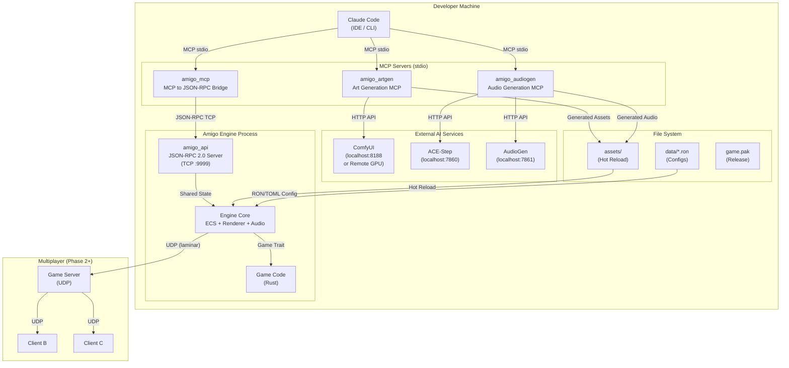
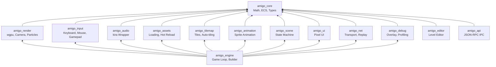

# Amigo Engine -- Service Architecture

Amigo Engine is a modular, Rust-based 2D game engine designed for AI-assisted development. Its architecture is built around a set of loosely coupled services that communicate through well-defined protocols. Claude Code drives development through MCP (Model Context Protocol) servers that bridge into the engine's JSON-RPC API, while external AI services handle procedural asset and audio generation. The engine itself is organized as a Cargo workspace of focused crates, each owning a single responsibility.

## Service Communication Overview

## Communication Protocols

| Connection | Protocol | Format | Direction |
|-----------|-----------|--------|----------|
| Claude Code <-> MCP Servers | MCP (stdio) | JSON-RPC 2.0 | Bidirectional |
| amigo_mcp <-> amigo_api | TCP Socket | JSON-RPC 2.0 | Bidirectional |
| amigo_artgen <-> ComfyUI | HTTP REST | JSON + Binary | Request/Response |
| amigo_audiogen <-> ACE-Step | HTTP REST | JSON + WAV | Request/Response |
| Engine <-> Assets | Filesystem | PNG/ASE/WAV/RON | Watch + Reload |
| Multiplayer Clients <-> Server | UDP (laminar) | Serialized Commands | Lockstep |

## Internal Engine Architecture

The engine is structured as a set of crates with `amigo_core` at the foundation and `amigo_engine` as the top-level integration crate that pulls everything together.

## Workspace Structure

The full workspace comprises **14 engine crates** (`amigo_core`, `amigo_render`, `amigo_input`, `amigo_audio`, `amigo_assets`, `amigo_tilemap`, `amigo_animation`, `amigo_scene`, `amigo_ui`, `amigo_net`, `amigo_debug`, `amigo_editor`, `amigo_api`, and `amigo_engine`), **4 standalone tools** (`amigo_mcp`, `amigo_artgen`, `amigo_audiogen`, and `amigo_paktool`), and **1 example game** that serves as both a integration test and a reference implementation.
