# Amigo Engine -- Spec Overview

## Vision

Amigo is a **Modern Pixel Art Game Engine** built in Pure Rust. It treats pixel art as an aesthetic choice, not a technical limitation. No artificial color limits, no forced palette constraints, no layer caps. The engine enables the kind of games that define modern pixel art: Celeste's particle effects and screen shake, Dead Cells' skeletal animation, Hyper Light Drifter's dynamic lighting -- all built on a pixel grid with the full power of modern GPUs.

### Core Principles

- **Pixel art is aesthetic, not limitation.** Unlimited colors, alpha transparency, blend modes, shader effects. The pixel grid is the only constraint.
- **One language, one toolchain.** Pure Rust. Game logic in Rust, data in RON/TOML (hot-reloadable). The Rust compiler is the feedback loop. No scripting layer.
- **Opinionated defaults, escape hatches when needed.** `draw_sprite("player", pos)` works out of the box. Typed handles exist for performance-critical paths.
- **Multiplayer-ready from day 1.** Client-Server architecture even in singleplayer. Deterministic simulation via Fixed-Point arithmetic. Serializable game state and command-based input.
- **AI-native development.** First-class IPC interface for AI agents (Claude Code). The engine can be observed, controlled, and debugged programmatically. Screenshot-based visual feedback, headless simulation, and a persistent command API allow AI to build levels, balance gameplay, run playtests, and debug issues autonomously.

### First Game

Tower Defense with 6 thematic worlds: Pirates of the Caribbean, Lord of the Rings, Dune, Matrix, Game of Thrones, Stranger Things. Each world has unique pixel art tilesets, tower types, enemy types, and atmospheric effects.

### Target Genres

The engine supports all classic 2D pixel art genres: Tower Defense, Platformer/Jump'n'Run, RPG/Adventure, Shmup/Shoot'em Up, Beat'em Up, Puzzle, Fighting Games, Run'n'Gun, Metroidvania.

## Tech Stack

### Language & Toolchain

| Component    | Choice                       | Rationale                                         |
| ------------ | ---------------------------- | ------------------------------------------------- |
| Language     | Rust (latest stable)         | Performance, safety, compiler feedback for AI dev |
| Build        | Cargo                        | Standard Rust toolchain                           |
| Data Format  | RON (primary), TOML (config) | Rust-native, readable, hot-reloadable             |
| Linker (dev) | mold                         | Fast incremental builds (1-3s)                    |

### Core Dependencies (Crates)

| Crate                 | Purpose                                             |
| --------------------- | --------------------------------------------------- |
| `wgpu`                | GPU rendering (Vulkan/DX12/Metal/WebGPU)            |
| `winit`               | Window creation, event loop, input                  |
| `gilrs`               | Gamepad input                                       |
| `kira`                | Audio (playback, mixing, spatial, crossfade)        |
| `fixed` (I16F16)      | Fixed-point arithmetic for deterministic simulation |
| `thiserror`           | Ergonomic custom error types                        |
| `tracing`             | Structured logging + Tracy integration              |
| `serde` + `serde_ron` | Serialization (state, commands, assets, saves)      |
| `notify`              | Filesystem watcher for hot reload                   |
| `bumpalo`             | Arena allocator for per-frame temp data             |
| `tracy-client`        | Performance profiling                               |
| `asefile`             | Aseprite file parsing                               |
| `fontdue`             | TTF font rasterization for Pixel UI                 |
| `image`               | Image loading/processing                            |
| `laminar`             | UDP networking with reliability layer               |
| `rustc-hash`          | Fast deterministic hashing (FxHashMap)              |

### Target Platforms (Phase 1)

| Platform | Backend         | Priority |
| -------- | --------------- | -------- |
| Windows  | DX12 via wgpu   | Primary  |
| Linux    | Vulkan via wgpu | Primary  |
| macOS    | Metal via wgpu  | Later    |
| Web/WASM | WebGPU via wgpu | Later    |

## Architecture

```
+-----------------------------------------------------------+
|                     Game Code (Rust)                        |
|          Scenes, Systems, Game Logic, AI                    |
+-----------------------------------------------------------+
|                  Data Files (RON/TOML)                      |
|        Tower stats, wave configs, level data                |
+----------+------------------------------------------------+
| Editor   |              Engine Core                         |
| (own UI, |  +---------+----------+------+------------+     |
|  feature |  |Renderer | Audio    | Net  | AI API     |     |
|  flag)   |  |(Batcher)| (kira)   |(UDP) | (IPC)      |     |
|          |  +---------+----------+------+------------+     |
|          |  |Tilemap  | Input    |Colli-| Pixel UI   |     |
|          |  |System   | System   |sion  | System     |     |
|          |  +---------+----------+------+------------+     |
|          |  |Camera   |Animation |Assets| Commands   |     |
|          |  |System   |System    |      | & State    |     |
|          |  +---------+----------+------+------------+     |
|          |  |  ECS (SparseSet) + Core Types & Math    |     |
|          |  |  (Fixed-Point, SimVec2, Rect, Color)    |     |
|          |  +------------------------------------------+    |
+----------+------------------------------------------------+
|                    wgpu / winit / gilrs                      |
+-----------------------------------------------------------+
```

### Module Structure (Cargo Workspace)

```
amigo-engine/                   # github.com/amigo-labs/amigo-engine
+-- Cargo.toml                  # Workspace root
+-- crates/
|   +-- amigo_core/              # Math, types, Fixed-Point, SparseSet ECS
|   +-- amigo_render/            # wgpu renderer, sprite batcher, camera
|   +-- amigo_ui/                # Pixel-native UI system (Game HUD + Editor widgets)
|   +-- amigo_audio/             # kira wrapper, audio manager
|   +-- amigo_input/             # Keyboard, mouse, gamepad abstraction
|   +-- amigo_tilemap/           # Tilemap system, collision layers
|   +-- amigo_animation/         # Sprite animation, Aseprite integration
|   +-- amigo_assets/            # Asset loading, hot reload, atlas packing
|   +-- amigo_net/               # Networking, transport trait, commands
|   +-- amigo_scene/             # Scene/state machine
|   +-- amigo_editor/            # Level editor (feature flag: "editor")
|   +-- amigo_api/               # AI/IPC interface (feature flag: "api")
|   +-- amigo_debug/             # Debug overlay, Tracy integration
|   +-- amigo_engine/            # Ties everything together, public API
+-- tools/
|   +-- amigo_cli/               # CLI: pack, build, release, new project
|   +-- amigo_mcp/               # MCP server wrapping amigo_api for Claude Code
|   +-- amigo_artgen/            # MCP server for AI art generation (ComfyUI)
|   +-- amigo_audiogen/          # MCP server for AI audio generation (ACE-Step, AudioGen)
+-- games/
|   +-- amigo_td/                # Tower Defense game
+-- assets/
    +-- ...
```

### Client-Server Architecture

```
Singleplayer:
  Client --fn calls--> Server    (same process, zero overhead)

Multiplayer:
  Client A --UDP--> Server --UDP--> Client B
                          --UDP--> Client C
```

All player input becomes serializable Commands. The server validates and applies them. This separation enables multiplayer, replays, save/load, and AI control through the same interface.

## Dependency Graph

```mermaid
graph TD
    core[engine/core]
    rendering[engine/rendering]
    audio[engine/audio]
    input[engine/input]
    tilemap[engine/tilemap]
    pathfinding[engine/pathfinding]
    animation[engine/animation]
    camera[engine/camera]
    ui[engine/ui]
    networking[engine/networking]
    memperf[engine/memory-performance]
    plugin[engine/plugin-system]
    fmt[assets/format]
    pipeline[assets/pipeline]
    atlas[assets/atlas]
    cli[tooling/cli]
    editor[tooling/editor]
    debug[tooling/debug]
    artgen[ai-pipelines/artgen]
    audiogen[ai-pipelines/audiogen]
    agentapi[ai-pipelines/agent-api]
    tddesign[games/td/design]
    tdui[games/td/ui]
    amigotoml[config/amigo-toml]
    datafmt[config/data-formats]

    rendering --> core
    audio --> core
    input --> core
    tilemap --> core
    pathfinding --> tilemap
    animation --> core
    camera --> core
    ui --> core
    ui --> rendering
    networking --> core
    plugin --> core
    pipeline --> fmt
    atlas --> fmt
    cli --> core
    editor --> core
    editor --> ui
    debug --> core
    artgen --> fmt
    audiogen --> audio
    agentapi --> core
    tddesign --> core
    tddesign --> tilemap
    tdui --> ui
    tdui --> tddesign
```



## Status Table

| Spec                                                      | Status | Crate             | Depends on                    |
| --------------------------------------------------------- | ------ | ----------------- | ----------------------------- |
| [engine/core](engine/core.md)                             | draft  | amigo_core        | --                            |
| [engine/rendering](engine/rendering.md)                   | draft  | amigo_render      | engine/core                   |
| [engine/audio](engine/audio.md)                           | draft  | amigo_audio       | engine/core                   |
| [engine/input](engine/input.md)                           | draft  | amigo_input       | engine/core                   |
| [engine/tilemap](engine/tilemap.md)                       | draft  | amigo_tilemap     | engine/core                   |
| [engine/pathfinding](engine/pathfinding.md)               | draft  | amigo_pathfinding | engine/tilemap                |
| [engine/animation](engine/animation.md)                   | draft  | amigo_animation   | engine/core                   |
| [engine/camera](engine/camera.md)                         | draft  | amigo_camera      | engine/core                   |
| [engine/ui](engine/ui.md)                                 | draft  | amigo_ui          | engine/core, engine/rendering |
| [engine/networking](engine/networking.md)                 | draft  | amigo_net         | engine/core                   |
| [engine/memory-performance](engine/memory-performance.md) | draft  | amigo_core        | --                            |
| [engine/plugin-system](engine/plugin-system.md)           | draft  | amigo_plugin      | engine/core                   |
| [assets/format](assets/format.md)                         | draft  | amigo_assets      | --                            |
| [assets/pipeline](assets/pipeline.md)                     | draft  | amigo_assets      | assets/format                 |
| [assets/atlas](assets/atlas.md)                           | draft  | amigo_assets      | assets/format                 |
| [tooling/cli](tooling/cli.md)                             | draft  | amigo_cli         | engine/core                   |
| [tooling/editor](tooling/editor.md)                       | draft  | amigo_editor      | engine/core, engine/ui        |
| [tooling/debug](tooling/debug.md)                         | draft  | amigo_debug       | engine/core                   |
| [ai-pipelines/artgen](ai-pipelines/artgen.md)             | draft  | amigo_artgen      | assets/format                 |
| [ai-pipelines/audiogen](ai-pipelines/audiogen.md)         | draft  | amigo_audiogen    | engine/audio                  |
| [ai-pipelines/agent-api](ai-pipelines/agent-api.md)       | draft  | amigo_api         | engine/core                   |
| [games/td/design](games/td/design.md)                     | draft  | amigo_td          | engine/core, engine/tilemap   |
| [games/td/ui](games/td/ui.md)                             | draft  | amigo_td          | engine/ui, games/td/design    |
| [config/amigo-toml](config/amigo-toml.md)                 | draft  | --                | --                            |
| [config/data-formats](config/data-formats.md)             | draft  | --                | --                            |

## Game-Specific Design

Asset pipeline decisions are maintained in a separate spec file:

- **Art Generation**: See [ai-pipelines/artgen](ai-pipelines/artgen.md) (ComfyUI integration, post-processing, style definitions)
- **Audio Generation**: See [ai-pipelines/audiogen](ai-pipelines/audiogen.md) (ACE-Step music gen, AudioGen SFX, adaptive music system, stem-based vertical layering)

## Implementation Phases

### Phase 1: Engine Foundation (4-6 weeks)

Window, sprite rendering, sprite batcher, virtual resolution, input, tilemap, basic camera, game loop (fixed timestep), scene machine, Lightweight ECS (SparseSet + Change Tracking), Pixel UI (Tier 1: Game HUD), RON/TOML config loading, asset hot reload, `tracing` logging.

### Phase 2: Game Systems (4-6 weeks)

Command system, serializable GameState, Aseprite loading, animations, AABB + spatial hash collision, waypoint pathfinding, tower/enemy/projectile systems, tower targeting (switchable priority), wave system, gold/lives, atmosphere manager (transitions, interpolation), adaptive music engine (vertical layering, bar clock, layer rules, horizontal transitions, stingers), SFX manager with variants, gamepad.

### Phase 3: Polish & Content (4-6 weeks)

6 worlds (tilesets, themes, atmosphere presets, music), multiple tower/enemy types per world, upgrades, particles, lighting, post-processing, camera polish, music crossfading, dynamic atmosphere logic, menus, save/load (slot system).

### Phase 4: Editor (3-5 weeks)

Editor plugin (feature flag), extended Pixel UI with editor widgets, tile painter, entity placement, path editor, undo/redo, .amigo format, edit-while-playing, wave editor UI.

### Phase 5: AI API + Asset Pipelines (3-4 weeks)

IPC server (amigo_api), JSON-RPC protocol, screenshot export, headless mode, event streaming. MCP server wrapper (amigo_mcp). Art generation pipeline (amigo_artgen): ComfyUI client, workflow builder, post-processing (palette clamp, outline, AA removal). Audio generation pipeline (amigo_audiogen): ACE-Step client, AudioGen client, stem generation, loop trimming, adaptive music config generation. Claude Code integration testing with all three MCP servers.

### Phase 6: Multiplayer (3-5 weeks)

Transport trait, deterministic verification (CRC), lockstep protocol, UDP networking, lobby, co-op mode, network debug overlay, replay system.

### Phase 7: AI Editor Features (3-5 weeks)

Auto-pathing, wave balancing, auto-decoration, AI playtesting (simulation + heatmaps), LLM integration (optional).

### Phase 8: Release (2-3 weeks)

amigo CLI (pack, build, release), typed asset handles (build script), release optimization, CI/CD, Steam/itch.io integration.

## Key Decisions

| Decision              | Choice                                                  | Rationale                                                                                     |
| --------------------- | ------------------------------------------------------- | --------------------------------------------------------------------------------------------- |
| Engine Name           | **Amigo Engine**                                        | Org: amigo-labs, Repo: amigo-engine, CLI: amigo                                               |
| Language              | Pure Rust                                               | Type safety, compiler feedback, AI-dev friendly                                               |
| Rendering             | wgpu, fixed pipeline with configurable stages        | No render graph, built-in + custom shaders per stage                                          |
| Scripting             | None                                                    | One language, one toolchain, compiler catches errors                                          |
| ECS                   | Lightweight, SparseSet + Change Tracking                | Cache-friendly, flexible for multi-genre, no macro magic                                      |
| ECS Storage           | Hybrid: hot components static, rest dynamic         | Best of both: zero-overhead core, flexible extensions                                         |
| Arithmetic            | Fixed-Point Q16.16                                      | Deterministic simulation for multiplayer + replays                                            |
| Audio                 | kira                                                    | Tweening, spatial, streaming, crossfade                                                       |
| UI                    | Own Pixel UI, two tiers                                 | Game HUD (always) + Editor widgets (feature flag). No egui                                    |
| Text Rendering        | TTF rasterizer (fontdue)                                | Unicode gratis, no font tools needed, pixel-fonts available                                   |
| Sprites               | Aseprite native                                         | No manual export, tag-based animations                                                        |
| Sprite Sorting        | Z-index only, Y-sort is game logic                      | Engine sorts by Z, game sets Z based on Y if needed                                           |
| Atlas Pipeline        | Dev: loose files, Release: packed                       | Fast iteration in dev, optimal draw calls in release                                          |
| Asset Loading         | Synchronous at startup                                  | No async handle-checking, cartridge-style, instant access                                     |
| Tilemap               | Orthogonal + Isometric, chunk streaming                 | First-class, auto-tiling, supports TD to Diablo-style                                         |
| Pathfinding           | A\* (dynamic) + Waypoints (TD) + Flow Fields (opt-in)   | Engine-level, covers all genres                                                               |
| Level Design          | Integrated editor (.amigo format)                       | Live preview, edit-while-playing, AI features                                                 |
| Networking            | Client-Server from day 1                                | Multiplayer-ready, enables replays + save/load                                                |
| AI Interface          | amigo_api (JSON-RPC) + amigo_mcp (MCP wrapper)          | Claude Code uses native MCP tools, scripts use JSON-RPC                                       |
| Art Pipeline          | amigo_artgen MCP + external ComfyUI                     | Krita-style: engine is client, ComfyUI is backend, post-processing in Rust                    |
| Audio Pipeline        | amigo_audiogen MCP + ACE-Step + AudioGen                | Local GPU, dual mode (quick split / clean per-stem), royalty-free                             |
| Adaptive Music        | Vertical layering + horizontal re-sequencing + stingers | Core melody conditioning, bar-synced transitions, per-world hybrid genres                     |
| Sound Style           | Hybrid (per world different genre + SFX style)          | Caribbean=shanty, LotR=orchestral, Dune=ambient, Matrix=synthwave, GoT=medieval, ST=80s synth |
| Transport             | Lockstep over UDP (laminar)                             | Simple, deterministic, co-op TD                                                               |
| Plugin System         | Feature Flags + Plugin Trait (World + Resources split)  | Compile-time modularity + clean lifecycle, no borrow issues                                   |
| Commands <-> ECS      | Commands = high-level API, ECS = implementation         | Commands travel over network/replay, ECS is internal                                          |
| Event System          | Double-buffer, events live one tick                     | Deterministic, no stale events, no memory growth                                              |
| Particles             | CPU-based, sprite batcher, RON templates                | No GPU compute needed for pixel art particle counts                                           |
| Error Handling        | `thiserror` + `Result` for init/assets                  | Graceful fallbacks in game loop, panics only for bugs                                         |
| Logging               | `tracing` crate                                         | Structured logging, Tracy integration, env-configurable                                       |
| Config                | TOML (engine), RON (input + game data)                  | Three clear layers, hot-reloadable game data                                                  |
| Save/Load             | Engine slot system (autosave, quicksave, rotation)      | Platform-aware paths, compression, corruption check                                           |
| Window/Event Loop     | winit ApplicationHandler internally                     | Clean Game trait API externally, headless mode bypasses winit                                 |
| Screen Transitions    | Game logic, not engine                                  | Engine provides tools (shaders, scene stack), game composes                                   |
| Gamepad Hot-Plug      | Engine fires event, game decides                        | No auto-pause, game-specific handling                                                         |
| Memory Pre-Allocation | Capacity hints per SparseSet                            | No reallocation in hot path, graceful growth if exceeded                                      |
| Query Caching         | Not now, optimize when Tracy shows need                 | Avoid premature complexity                                                                    |
| Memory Budget         | No hard limits, debug overlay logs usage                | Pixel art has no memory pressure, monitor for leaks                                           |
| Distribution          | Windows + Linux                                         | Primary targets, cross-compile from WSL2                                                      |
| Profiling             | Tracy from day 1                                        | Real profiling > guessing                                                                     |
| Editor                | In-engine (own Pixel UI), feature flag                  | Zero release overhead, consistent pixel art aesthetic                                         |
| Camera                | Pre-built patterns                                      | Follow, deadzone, room-lock, shake built-in                                                   |
| From Bevy             | State-scoped cleanup, Tick Scheduler                    | Improved: sync assets, no macros, better error msgs                                           |
